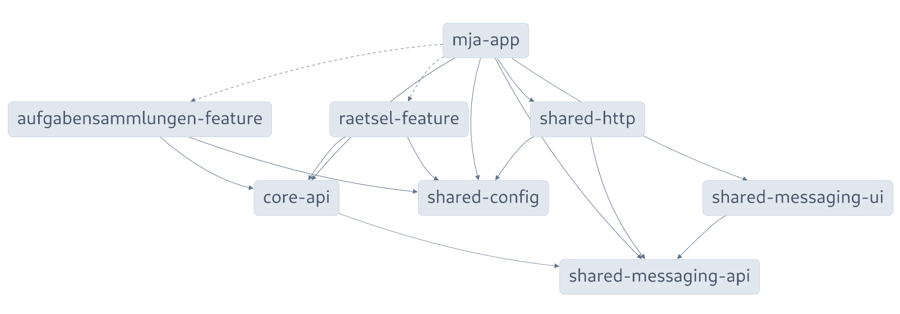
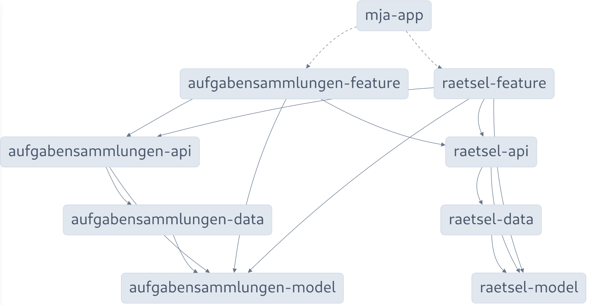
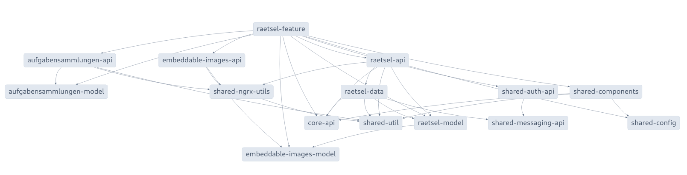
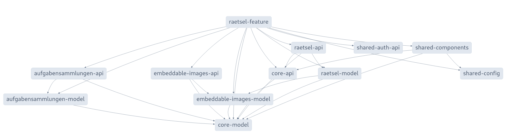
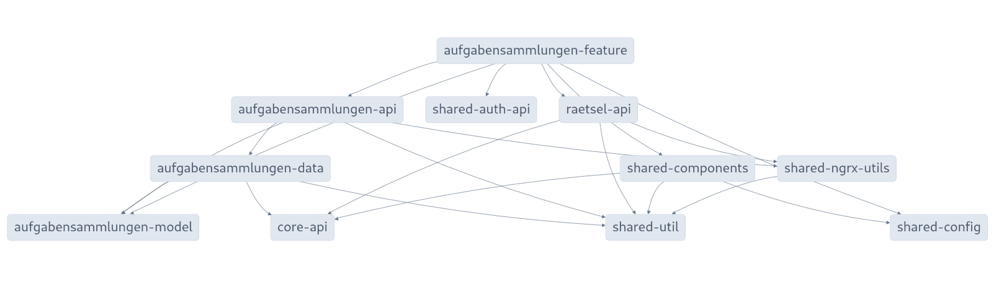

# Struktur

Siehe [Taming Code Organization with Module Boundaries in Nx](https://dev.to/nx/taming-code-organization-with-module-boundaries-in-nx-1icl)

## Dependency Graphs

### mja-app mit direkten Abhängigkeiten

### mja-app mit den aktuellen domains scopes

### domain raetsel mit Abhängigkeiten

### feature raetsel mit direkten Abhängigkeiten

### domain aufgabensammlunen mit Abhängigkeiten

## Typen von Libraries

### Haupttypen

- app - Eine Anwendung
- feature (UI-Components zu einem domain)
- api (Interfaces, die von feature verwendet werden)
- data (kapselt die Daten eines features - nur durch api zugänglich)
- model (fachliche domain-Objekte)
- utils (übergreifende Funktionen)
- shared (UI-Components, Layout, Auth, Messages)

### Untertypen

- domain:api
- domain-model
- core-api
- core-model
- 

