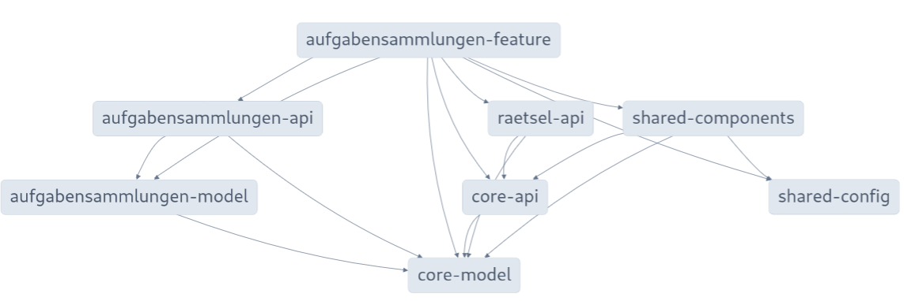
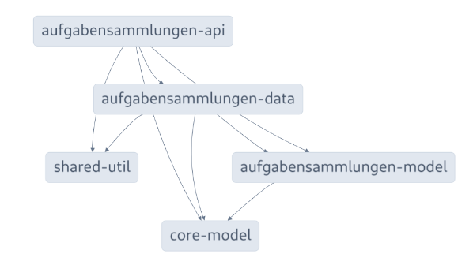
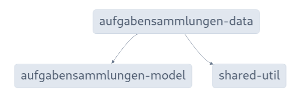
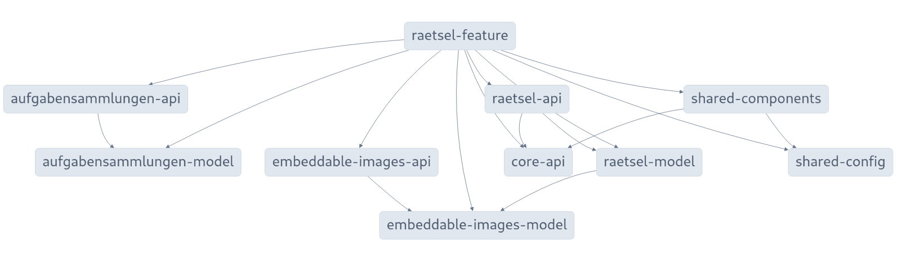
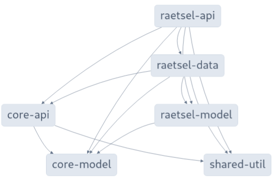
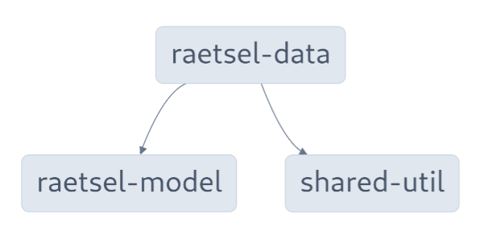
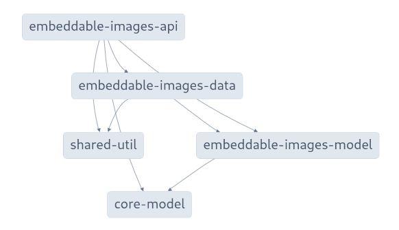
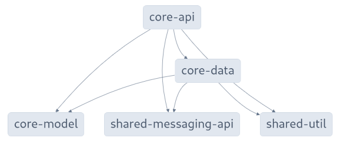
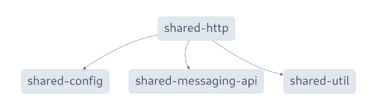

# Struktur

Siehe [Taming Code Organization with Module Boundaries in Nx](https://dev.to/nx/taming-code-organization-with-module-boundaries-in-nx-1icl)

und

[How to organize and name applications and libraries in an nx-monorepo](https://medium.com/showpad-engineering/how-to-organize-and-name-applications-and-libraries-in-an-nx-monorepo-for-immediate-team-wide-9876510dbe28)

[A project without tags matching at least one constraint cannot depend on any libraries](https://www.jvandemo.com/how-to-deal-with-the-tslint-error-a-project-without-tags-cannot-depend-on-any-libraries-in-an-nx-monorepo/)

## mja-app mit direkten Abhängigkeiten


__dependencies:__

- shared/http
- shared/config
- core-api
- shared/messaging-ui
- shared/messaging-api

## aufgabensammlungen

### aufgabensammlunen feature mit direkten Abhängigkeiten



__dependencies:__

- aufgabensammlungen-api
- aufgabensammlungen-model
- core-api
- raetsel-api
- shared/components
- shared/config (die könnte auch noch weg. Ist nur wegen env drin, um componentennamen anzuzeigen)

### aufgabensammlunen api mit direkten Abhängigkeiten



__dependencies:__

- aufgabensammlungen-data
- aufgabensammlungen-model
- core-model
- shared-ngrx-util
- shared-util

### aufgabensammlungen data mit direkten Abhängigkeiten



__dependencies:__

- aufgabensammlungen-model
- shared-util

## raetsel

### raetsel feature mit direkten Abhängigkeiten



__dependencies:__

- raetsel-api
- raetsel-model
- aufgabensammlungen-api
- aufgabensammlungen-model
- embedabble-images-api
- embedabble-images-model
- core-api 
- shared-components
- shared-config (die könnte auch noch weg. Ist nur wegen env drin, um componentennamen anzuzeigen)

### raetsel api mit direkten Abhängigkeiten



__dependencies:__

- raetsel-data
- raetsel-model
- core-api
- core-model
- shared-util


### raetsel data mit Abhängigkeiten



__dependencies:__

- raetsel-model
- shared-util

## embeddable images

### embeddable images api mit direkten Abhängigkeiten



__dependencies:__

- embeddable-images-data
- embeddable-images-model
- core-model
- shared-util

## core

### core api mit direkten Abhängigkeiten



__dependencies:__

- core-data
- core-model
- shared-messaging-api
- shared-util

## shared libs

### shared/components



__dependencies:__

- core-model
- core-api
- shared/config
- shared/util

### shared/http


__dependencies:__

- shared/config
- shared/util
- shared/messaging-api


## Libs mit Tags

| library | tags | 
|---------|------|
| mja-app | type:app |
| core-api |  type:core:api |
| core-data | type:core:data |
| core-model | type:core:model |
| aufgabensammlungen-api | type:api |
| aufgabensammlungen-data | type:data |
| aufgabensammlungen-feature | type:feature |
| aufgabensammlungen-model | type:model |
| raetsel-api | type:api |
| raetsel-data | type:data |
| raetsel-feature | type:feature |
| raetsel-model | type:model |
| embeddable-images-api | type:api |
| embeddable-images-data | type:data |
| embeddable-images-model | type:model |
| local-storage-data | type:local-storage-data |
| shared/components | type:shared:ui | 
| shared/config | type:config | 
| shared/http | type:shared:http | 
| shared/layout | type:shared:ui | 
| shared/messaging-api | type:shared:api | 
| shared/messaging-ui | type:shared:ui | 
| shared/util | type:util | 


## Typen von Libraries

### Haupttypen

- app - Eine Anwendung
- feature (UI-Components zu einem domain)
- api (Interfaces, die von feature verwendet werden)
- data (kapselt die Daten eines features - nur durch api zugänglich)
- model (fachliche domain-Objekte)
- utils (übergreifende Funktionen)
- shared (UI-Components, Layout, Auth, Messages)

## Ergebnis (14.12.2023)

```
"@nx/enforce-module-boundaries": [
          "error",
          {
            "banTransitiveDependencies": true,
            "enforceBuildableLibDependency": true,
            "allow": [],
            "depConstraints": [
              {
                "sourceTag": "type:app",
                "onlyDependOnLibsWithTags": [
                  "type:feature",
                  "type:shared:http",
                  "type:config",
                  "type:shared:ui",
                  "type:shared:api",
                  "type:core:api",
                  "type:local-storage-data"
                ]
              },
              {
                "sourceTag": "type:feature",
                "onlyDependOnLibsWithTags": [
                  "type:api",
                  "type:core:api",
                  "type:core:model",
                  "type:model",
                  "type:shared:ui",
                  "type:shared:api",
                  "type:config"
                ],
                "bannedExternalImports": [
                  "@ngrx/**"
                ]
              },
              {
                "sourceTag": "type:api",
                "onlyDependOnLibsWithTags": [
                  "type:data",
                  "type:model",
                  "type:core:api",
                  "type:core:model",
                  "type:util"
                ]
              },
              {
                "sourceTag": "type:data",
                "onlyDependOnLibsWithTags": [
                  "type:model",
                  "type:util",
                  "type:core:api",
                  "type:core:model",
                  "type:shared:api"
                ]
              },
              {
                "sourceTag": "type:core:api",
                "onlyDependOnLibsWithTags": [
                  "type:shared:ui",
                  "type:shared:api",
                  "type:core:data",
                  "type:core:model",
                  "type:util"
                ]
              },
              {
                "sourceTag": "type:core:data",
                "onlyDependOnLibsWithTags": [
                  "type:shared:ui",
                  "type:shared:api",
                  "type:core:model",
                  "type:util"
                ]
              },
              {
                "sourceTag": "type:shared:ui",
                "onlyDependOnLibsWithTags": [
                  "type:shared:api",
                  "type:config",
                  "type:util",
                  "type:core:model",
                  "type:core:api"
                ]
              },
              {
                "sourceTag": "type:shared:http",
                "onlyDependOnLibsWithTags": [
                  "type:config",
                  "type:util",
                  "type:shared:api"
                ]
              },
              {
                "sourceTag": "type:model",
                "onlyDependOnLibsWithTags": [
                  "type:model",
                  "type:core:model"
                ]
              },              
              {
                "sourceTag": "type:local-storage-data",
                "onlyDependOnLibsWithTags": [
                  "type:util",
                  "type:core:data"
                ]
              },              
              {
                "sourceTag": "type:core:model",
                "onlyDependOnLibsWithTags": [
                  "type:core:model"
                ]
              },
              {
                "sourceTag": "type:config",
                "onlyDependOnLibsWithTags": [
                  "type:config"
                ]
              },
              {
                "sourceTag": "type:util",
                "onlyDependOnLibsWithTags": [
                  "type:util"
                ]
              }
            ]
          }
        ]
```